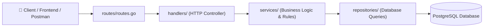

# 🛒 Mini Order Management API (Golang + Clean Architecture)


Mini Order Management API adalah backend service berkinerja tinggi yang dibangun menggunakan **Golang**, framework **Gin**, ORM **GORM**, dan database **PostgreSQL**. Proyek ini menerapkan **Clean Architecture (Repository-Service-Handler Pattern)** dengan pemisahan tanggung jawab yang modular, penanganan *idempotency* untuk simulasi Webhook Payment Gateway, serta validasi request DTO yang aman.

---

## 🏛️ Arsitektur Sistem (Layered Clean Architecture)



* **`models/`**: Definisi entitas data, tag GORM, tag JSON, dan DTO input binding.
* **`repositories/`**: Abstraksi akses database (kueri SQL & GORM terisolasi).
* **`services/`**: Tempat utama aturan bisnis, validasi logika domain, dan *idempotency check*.
* **`handlers/`**: Murni menangani protokol HTTP, binding JSON, dan formatting respons status code.
* **`routes/`**: Mengatur endpoint URL dan melakukan *Dependency Injection*.
* **`config/`**: Inisialisasi koneksi pool PostgreSQL dan fitur *Auto-Migration*.

---

## 📁 Struktur Folder Proyek

```text
.
├── config/
│   └── database.go             # Inisialisasi koneksi GORM & Auto-Migration
├── handlers/
│   ├── health_handler.go       # Health check controller
│   └── order_handler.go        # HTTP controller pesanan & webhook
├── models/
│   ├── order.go                # Struct Order entity & CreateOrderInput DTO
│   └── webhook.go              # DTO PaymentWebhookPayload (Enum validation)
├── repositories/
│   └── order_repository.go     # Repository interface & implementasi GORM
├── services/
│   └── order_service.go        # Service interface & implementasi Business Logic
├── routes/
│   └── routes.go               # Router engine & Dependency Injection wiring
├── .env.example                # Template konfigurasi environment variable
├── .gitignore                  # Git ignore file
├── go.mod                      # Dependensi Go module
├── go.sum                      # Checksum dependensi
├── main.go                     # Entrypoint & HTTP server bootstrap
└── README.md                   # Dokumentasi lengkap proyek
```

---

## 🚀 Panduan Setup & Instalasi (Dari Awal)

### 1. Prasyarat Sistem
* **Golang**: Versi `1.21` ke atas ([Download Go](https://go.dev/dl/))
* **PostgreSQL**: Versi `14` ke atas ([Download PostgreSQL](https://www.postgresql.org/download/))
* **Git**: Terpasang di sistem ([Download Git](https://git-scm.com/))

---

### 2. Clone Repository & Masuk ke Direktori

```bash
git clone https://github.com/OpikSendy/golang.git
cd golang
```

---

### 3. Buat Database di PostgreSQL

Buka terminal PostgreSQL (`psql`) atau GUI (DBeaver / pgAdmin), lalu buat database baru:

```sql
CREATE DATABASE mini_order_db;
```

---

### 4. Konfigurasi Environment Variable (`.env`)

Salin file template `.env.example` menjadi `.env`:

**Di Linux/macOS/Git Bash:**
```bash
cp .env.example .env
```

**Di Windows (CMD / PowerShell):**
```powershell
Copy-Item .env.example .env
```

Sesuaikan kredensial database di dalam file `.env`:

```env
DB_HOST=localhost
DB_USER=postgres
DB_PASSWORD=postgres
DB_NAME=mini_order_db
DB_PORT=5432
DB_SSLMODE=disable
DB_TIMEZONE=Asia/Jakarta

APP_PORT=8080
```
> *(Catatan: Sesuaikan `DB_PORT` dan `DB_PASSWORD` sesuai konfigurasi PostgreSQL lokal kamu).*

---

### 5. Download Dependensi & Jalankan Aplikasi

```bash
# Download modul
go mod tidy

# Jalankan server
go run main.go
```

Output terminal saat server berhasil aktif:
```text
✅ Berhasil terhubung ke Database PostgreSQL!
✅ Auto-Migration tabel 'orders' berhasil!
🚀 Server aktif di http://localhost:8080
```

---

## 📖 Dokumentasi Endpoint API

Base URL: `http://localhost:8080`

### 1. Health Check
* **Method**: `GET`
* **URL**: `/health`
* **Response (200 OK)**:
```json
{
  "status": "ok",
  "message": "Mini Order Management API is running healthy! 🚀"
}
```

---

### 2. Buat Pesanan Baru (Create Order)
* **Method**: `POST`
* **URL**: `/api/v1/orders`
* **Headers**: `Content-Type: application/json`
* **Request Body**:
```json
{
  "customer_name": "Isyandi Fadillah",
  "item_name": "Kopi Latte Extra Shot",
  "amount": 28000
}
```

* **cURL Command**:
```bash
curl -X POST http://localhost:8080/api/v1/orders \
  -H "Content-Type: application/json" \
  -d '{"customer_name":"Isyandi Fadillah","item_name":"Kopi Latte Extra Shot","amount":28000}'
```

* **Response (201 Created)**:
```json
{
  "success": true,
  "message": "Pesanan berhasil dibuat",
  "data": {
    "id": 1,
    "customer_name": "Isyandi Fadillah",
    "item_name": "Kopi Latte Extra Shot",
    "amount": 28000,
    "status": "pending",
    "created_at": "2026-08-19T09:33:12+07:00",
    "updated_at": "2026-08-19T09:33:12+07:00"
  }
}
```

---

### 3. Ambil Semua Daftar Pesanan (Get All Orders)
* **Method**: `GET`
* **URL**: `/api/v1/orders`
* **Response (200 OK)**:
```json
{
  "success": true,
  "message": "Daftar pesanan berhasil diambil",
  "total": 1,
  "data": [
    {
      "id": 1,
      "customer_name": "Isyandi Fadillah",
      "item_name": "Kopi Latte Extra Shot",
      "amount": 28000,
      "status": "pending",
      "created_at": "2026-08-19T09:33:12+07:00",
      "updated_at": "2026-08-19T09:33:12+07:00"
    }
  ]
}
```

---

### 4. Ambil Detail Pesanan Berdasarkan ID (Get Order By ID)
* **Method**: `GET`
* **URL**: `/api/v1/orders/:id` (Contoh: `/api/v1/orders/1`)
* **Response (200 OK)**:
```json
{
  "success": true,
  "message": "Detail pesanan berhasil ditemukan",
  "data": {
    "id": 1,
    "customer_name": "Isyandi Fadillah",
    "item_name": "Kopi Latte Extra Shot",
    "amount": 28000,
    "status": "pending",
    "created_at": "2026-08-19T09:33:12+07:00",
    "updated_at": "2026-08-19T09:33:12+07:00"
  }
}
```

---

### 5. Webhook Notifikasi Pembayaran (Payment Gateway Webhook)
* **Method**: `POST`
* **URL**: `/api/v1/webhooks/payment`
* **Headers**: `Content-Type: application/json`
* **Request Body**:
```json
{
  "order_id": 1,
  "payment_status": "paid",
  "transaction_id": "TRX-PG-20260819"
}
```

* **cURL Command**:
```bash
curl -X POST http://localhost:8080/api/v1/webhooks/payment \
  -H "Content-Type: application/json" \
  -d '{"order_id":1,"payment_status":"paid","transaction_id":"TRX-PG-20260819"}'
```

* **Response (200 OK)**:
```json
{
  "success": true,
  "message": "Status pesanan berhasil diperbarui melalui Webhook",
  "transaction_id": "TRX-PG-20260819",
  "data": {
    "id": 1,
    "customer_name": "Isyandi Fadillah",
    "item_name": "Kopi Latte Extra Shot",
    "amount": 28000,
    "status": "paid",
    "created_at": "2026-08-19T09:33:12+07:00",
    "updated_at": "2026-08-19T09:33:12+07:00"
  }
}
```

> **🛡️ Fitur Idempotency**: Jika webhook pembayaran dengan status `paid` dikirim ulang untuk order yang sama, sistem tidak akan memproses ulang dan langsung mengembalikan notifikasi aman bahwa order sudah terbayar.

---

## 🗺️ Roadmap Pembelajaran yang Diselesaikan

1. **Modul 1: Inisialisasi & Struktur Dasar**: Setup Go Modules, Framework Gin, struktur folder modular, dan Global Health Check.
2. **Modul 2: Database & Model (GORM)**: Integrasi PostgreSQL, pemetaan struct GORM, dan fitur Auto-Migration.
3. **Modul 3: Core Business Logic (CRUD)**: DTO request validation (`binding:"required,gt=0"`), penanganan HTTP Error 404, dan query PostgreSQL.
4. **Modul 4: Webhook Handler**: Simulasi callback Payment Gateway, validasi whitelist enum (`oneof=paid failed cancelled`), dan Idempotency Check.
5. **Modul 5: Refactoring Clean Architecture**: Pemisahan layer Repository $\rightarrow$ Service $\rightarrow$ Handler $\rightarrow$ Routes dengan Dependency Injection dan Atomic Commits.

---

## 👨‍💻 Penulis
**Isyandi Muhammad Fadillah (OpikSendy)**
* GitHub: [@OpikSendy](https://github.com/OpikSendy)
