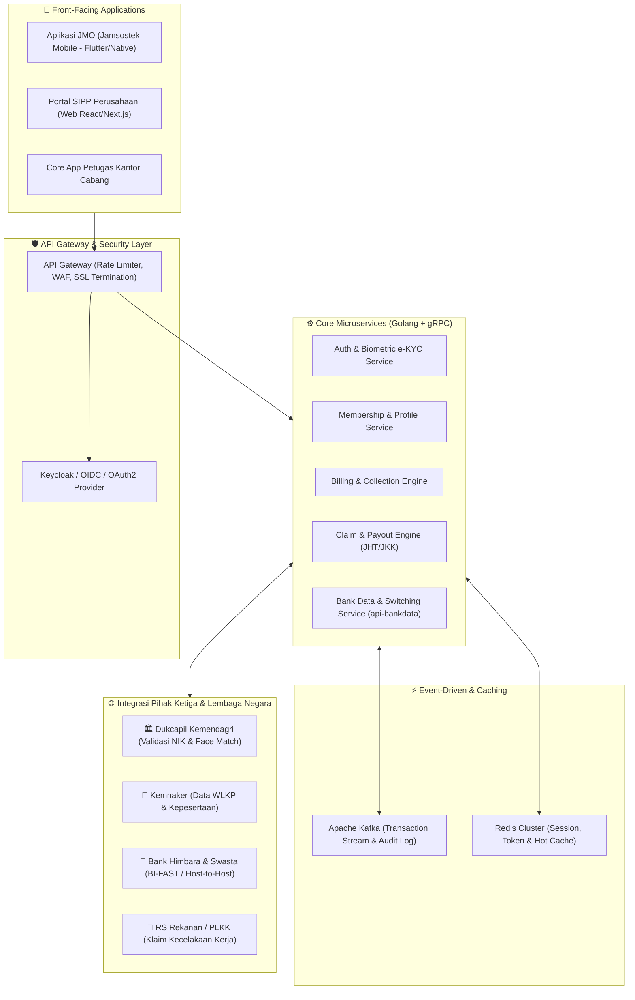

# 🏛️ Panduan & Referensi Arsitektur Backend: BPJS Ketenagakerjaan Scale

Dokumen ini merangkum arsitektur sistem, pola integrasi, dan studi kasus nyata (*real-world case study*) pengembangan backend Golang untuk institusi skala enterprise nasional seperti **BPJS Ketenagakerjaan**.

---

## 📊 1. Skala & Tantangan Sistem

BPJS Ketenagakerjaan mengelola 5 program jaminan sosial ketenagakerjaan:
* **JHT (Jaminan Hari Tua)**
* **JKK (Jaminan Kecelakaan Kerja)**
* **JKM (Jaminan Kematian)**
* **JP (Jaminan Pensiun)**
* **JKP (Jaminan Kehilangan Pekerjaan)**

### Tantangan Teknis Utama:
1. **High Concurrency**: Melayani **>30 juta peserta aktif** dan ratusan ribu perusahaan (PPU & BPU).
2. **Financial Integrity**: Memproses transaksi triliunan rupiah dengan nol toleransi terhadap *race condition* atau manipulasi saldo.
3. **Multi-Institution Interoperability**: Integrasi simultan dengan Perbankan (Himbara & Swasta), Dukcapil Kemendagri, Kemnaker, dan Rumah Sakit Rekanan (PLKK).

---

## 🏗️ 2. Peta Arsitektur Enterprise (High-Level Architecture)

---

## 🔍 3. Studi Kasus Nyata: Bedah Proyek `api-bankdata` BPJS Ketenagakerjaan

Berdasarkan struktur manifest dependensi riil (`go.mod`) internal BPJS Ketenagakerjaan:

### Modul & Komponen yang Dipakai:

| Package | Peran Arsitektur | Penjelasan Praktik Industri |
| :--- | :--- | :--- |
| `github.com/gofiber/fiber/v2` | **Web Framework (HTTP Engine)** | Framework berbasis *Fasthttp* dengan latensi ultra-rendah dan alokasi memori minimal. |
| `xorm.io/xorm` | **Database ORM** | ORM fleksibel yang mendukung banyak driver SQL sekaligus (MySQL + Oracle). |
| `github.com/go-sql-driver/mysql` | **Driver MySQL** | Digunakan untuk database operasional relasional standar. |
| `github.com/mattn/go-oci8` | **Driver Oracle Database** | Menghubungkan Golang ke **Oracle DB Enterprise** (Core Banking & Settlement System BPJS). |
| `github.com/go-redis/redis/v8` | **Distributed Cache** | Cache data rekening bank dan token verifikasi untuk mengurangi beban kueri ke Oracle DB. |
| `github.com/golang-jwt/jwt/v4` | **Security & Auth** | Otorisasi berbasis Bearer Token JWT antar-service. |
| `github.com/go-ozzo/ozzo-validation/v4` | **Request DTO Validation** | Validasi aturan bisnis di layer handler/DTO sebelum masuk ke service. |
| `github.com/google/uuid` | **Unique Identifier** | Generate UUID v4 untuk idempotency key dan trace ID transaksi. |
| `github.com/stretchr/testify` | **Testing & Mocking** | Unit test otomatis pada service dan repository. |
| `git.bpjsketenagakerjaan.go.id/ptk-lab/syslog` | **Centralized Logging** | Library internal untuk pengiriman audit log ke SIEM / log aggregator BPJS. |

---

## 🔌 4. Integrasi Kunci Lintas Sektor

### A. Integrasi Perbankan (Himbara, Swasta, BI-FAST)
* **Kanal Pembayaran**: Virtual Account (VA), Autodebet, QRIS, Over-the-Counter (Indomaret/Pos).
* **Protokol**: Host-to-Host (H2H) REST API dengan tanda tangan digital (**HMAC SHA-256 / RSA-2048**) atau protokol perbankan **ISO 8583**.
* **Reconciliation Engine**: Job terjadwal di Golang yang membandingkan file MT940 / CSV mutasi bank dengan data iuran lokal setiap cut-off harian.

### B. Integrasi Data Kependudukan (Dukcapil Kemendagri)
* **Tujuan**: Memvalidasi NIK KTP dan mencocokkan biometrik foto wajah (*Face Recognition Liveness*) saat pengajuan klaim JHT via aplikasi **JMO**.
* **Alur**: Handler Golang $\rightarrow$ Enkripsi Payload AES-256 $\rightarrow$ Hit API Dukcapil $\rightarrow$ Verifikasi kecocokan data $>95\%$.

### C. Integrasi RS Rekanan (PLKK - Pusat Layanan Kecelakaan Kerja)
* **Tujuan**: Menerbitkan Surat Jaminan Perawatan (SJP) otomatis saat peserta masuk IGD rumah sakit tanpa perlu membayar biaya di muka.
* **Alur**: SIMRS RS Rekanan memanggil API BPJS untuk memvalidasi nomor kepesertaan dan eligibility klaim kecelakaan kerja.

---

## 🔄 5. Komunikasi Data & Reliability Patterns

### 1. gRPC vs REST
* **External Clients (Mobile/Web)** $\rightarrow$ Menggunakan **REST API / JSON** (lewat Gin atau Fiber).
* **Internal Inter-Microservice** $\rightarrow$ Menggunakan **gRPC (Protocol Buffers)** melalui HTTP/2 binary stream untuk kecepatan transmisi data dengan latensi $<5$ ms.

### 2. Event Streaming dengan Apache Kafka
* Setiap ada event kritis (misal: `PaymentReceivedEvent`, `ClaimApprovedEvent`), service Golang mempublikasikan (*publish*) pesan ke Kafka Topic.
* Service lain (Notifikasi, Ledger, Audit) menjadi *consumer* yang memproses pesan secara asinkron tanpa memblokir request user.

### 3. Idempotency & Mutex Locking
* **Mencegah Double Payout**: Ketika proses pencairan dana klaim JHT dieksekusi, sistem menggunakan **Distributed Lock (Redis Redlock)** berdasarkan `order_id`/`claim_id` agar tidak ada dua proses pencairan yang berjalan bersamaan (*race condition*).

---

## ⚖️ 6. Perbandingan: Stack Pembelajaran vs Stack BPJS

| Komponen | Proyek Mini Order Kita | Sistem Riil `api-bankdata` BPJS |
| :--- | :--- | :--- |
| **Pola Arsitektur** | Clean Architecture (Repo-Service-Handler) | Clean Architecture (Repo-Service-Handler) |
| **HTTP Framework** | **Gin** (`github.com/gin-gonic/gin`) | **Fiber v2** (`github.com/gofiber/fiber/v2`) |
| **ORM** | **GORM** (`gorm.io/gorm`) | **XORM** (`xorm.io/xorm`) |
| **Primary Database** | PostgreSQL | MySQL & Oracle Database |
| **Caching Layer** | - | Redis Cluster (`go-redis/redis/v8`) |
| **Autentikasi** | Basic Route Protection | JWT (`golang-jwt/jwt/v4`) |
| **Validasi DTO** | Struct Binding Tags (`binding:"required"`) | Ozzo Validation |

---

## 🎯 7. Rekomendasi Roadmap Belajar Selanjutnya

Untuk melanjutkan skill Golang ke level yang siap terjun langsung ke sistem sekelas BPJS:

1. **Topik 1: JWT Authentication & Middleware**
   * Membuat login, hashing password dengan `bcrypt`, dan memproteksi rute menggunakan middleware JWT.
2. **Topik 2: Caching dengan Redis di Golang**
   * Mengintegrasikan `go-redis` untuk menyimpan query cache dan session login.
3. **Topik 3: Unit Testing & Mocking (Testify)**
   * Menulis unit test untuk layer Service dan Repository menggunakan `github.com/stretchr/testify`.
4. **Topik 4: Microservices & gRPC**
   * Membuat service terpisah yang berkomunikasi menggunakan Protocol Buffers (`.proto`).
5. **Topik 5: Message Broker (Kafka / RabbitMQ)**
   * Menerapkan Producer & Consumer untuk pemrosesan transaksi asinkron.
