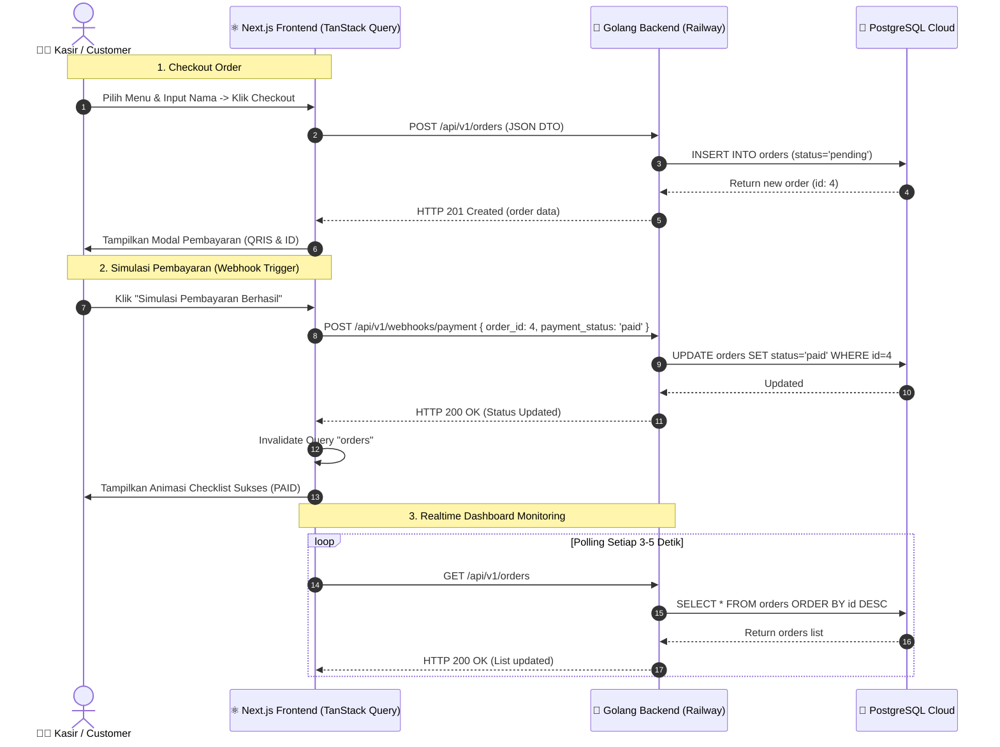

# 🛠️ 02 - Technical Requirement Document (TRD) & Architecture

## 💻 Tech Stack Specification

* **Framework**: **Next.js 15 (App Router)**
* **Language**: **TypeScript** (Strict Mode)
* **Server State & Data Fetching**: **TanStack React Query v5** (`@tanstack/react-query`)
  * Fitur: SSR Initial Hydration, Client-side Auto Polling, Optimistic Mutation, Cache Invalidation (`queryClient.invalidateQueries`).
* **Styling & UI**: **Tailwind CSS v3/v4** + Vanilla CSS Variables (Glassmorphism & Micro-animations)
* **Icons**: **Lucide React** (`lucide-react`)
* **HTTP Client**: Native `fetch` with typed Axios / Fetch wrapper.
* **Deployment Platform**: Vercel / Railway.

---

## 🏛️ System Architecture Flow (Fullstack Integration)



---

## 📂 Struktur Folder Frontend (Feature-First)

```text
src/
├── app/
│   ├── layout.tsx              # Root Layout + TanStack Query Client Provider
│   ├── page.tsx                # Main Landing / Cashier POS View
│   ├── orders/
│   │   └── page.tsx            # Live Order Tracker & Admin Dashboard (SSR + Hydration)
│   └── globals.css             # Tailwind Directives & Custom Glassmorphism Classes
├── components/
│   ├── ui/                     # Reusable UI (Button, Badge, Modal, Card, Input)
│   ├── navbar.tsx              # Navigation Bar & Live Server Health Status
│   └── providers.tsx           # QueryClientProvider & React Query Devtools
├── features/
│   ├── pos/
│   │   ├── components/         # MenuGrid, MenuItemCard, CartDrawer, OrderSummary
│   │   └── data/               # staticMenuItems.ts
│   ├── payment/
│   │   └── components/         # PaymentModal, QrisViewer, WebhookSimulator
│   └── orders/
│       ├── components/         # OrderTable, OrderCard, StatusBadge, RevenueStats
│       └── hooks/              # useOrders.ts, useCreateOrder.ts, usePaymentWebhook.ts
├── lib/
│   ├── api.ts                  # Base Fetch API client ke https://golangpr.up.railway.app
│   └── utils.ts                # Currency formatter (IDR), date helper
└── types/
    └── order.ts                # TypeScript Interfaces (Order, CreateOrderInput, PaymentWebhookPayload)
```

---

## ⚡ Strategi SSR & TanStack Query Hydration

1. **Server Component Initial Fetch**:
   * Halaman `/orders` melakukan prefetch data di server menggunakan `QueryClient` dan `dehydrate()`.
   * Mengirim HTML yang sudah berisi data awal ke browser (SEO Friendly & Fast First Paint).
2. **Client Component Hydration**:
   * Komponen klien membungkus data dengan `<HydrationBoundary state={dehydratedState}>`.
   * Mengaktifkan *auto-refetch interval* (misal tiap 4 detik) dan mutasi instan dengan `useMutation`.
