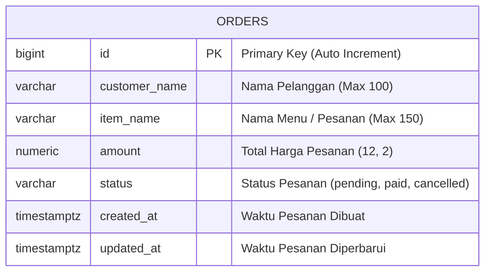
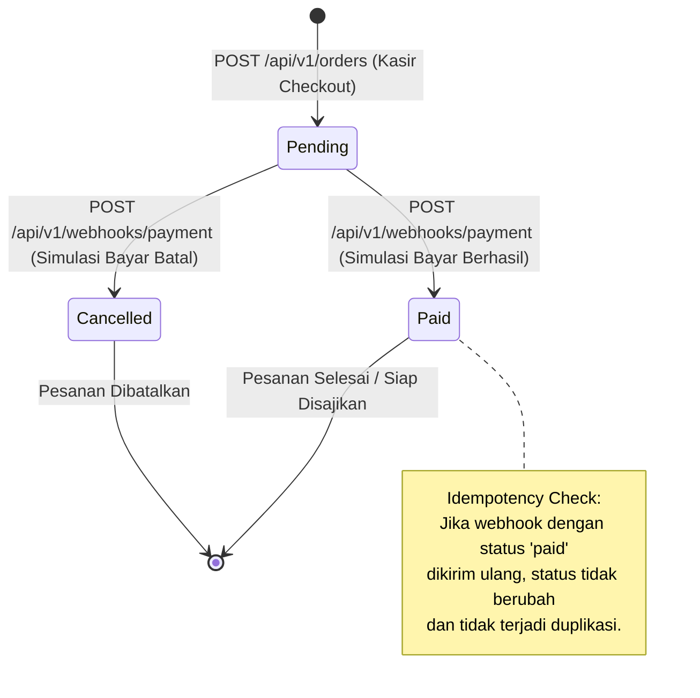

# 🗄️ 03 - Database Entity Relationship & State Diagram

## 📊 Database Schema (PostgreSQL via Backend GORM)

Aplikasi Frontend berinteraksi dengan tabel `orders` yang di-manage oleh backend Golang:

---

## 🔄 Lifecycle & State Transition Pesanan

